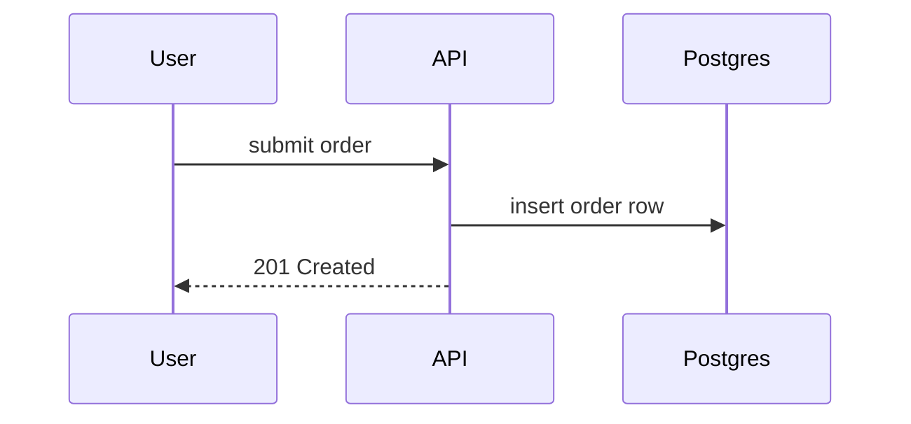

# PR Sequence Diagram

## Purpose

A reviewer opening a PR needs to understand the *motive* of the change in seconds — not line-by-line, but "user clicks X, which now also does Y before Z". A dense or exhaustive diagram defeats that purpose. The output of this skill is a one-glance Mermaid sequence diagram that captures the dominant flow the PR introduces or changes.

This is a **summary artifact**, not a trace. It is OK — and expected — to omit most of the diff. Pick the flow that best explains why the PR exists.

## When to run

Run when the user asks to visualize, diagram, or "show the flow" of a PR or branch. Commonly invoked after `/review` as a complementary artifact.

## Inputs

- **Scope**: the diff of the current branch vs. its base branch. Determine the base branch in this order:
  1. If the user names one ("against main", "vs. develop"), use it.
  2. Else, use the branch's upstream merge-base if it exists (`git merge-base HEAD @{u}` — but usually `main` or `master`).
  3. Else, fall back to `main`, then `master`.
- **Diff content**: use `git diff <base>...HEAD` (three dots — the diff from the merge-base) plus `git log <base>..HEAD --oneline` for commit intent.

If the branch has no diff vs. the base, stop and tell the user — there is nothing to diagram.

## Process

### 1. Read the change holistically

Before drawing anything, read the diff end-to-end. The goal is to answer: **what does this PR make the system do that it didn't before?** Look at:

- Commit messages and the PR title if available (`gh pr view --json title,body` when in a repo with a PR).
- New or modified entry points: HTTP handlers, event subscribers, CLI commands, UI components, scheduled jobs.
- New calls *out* that didn't exist before: API requests, DB queries, queue publishes, service calls.
- Control-flow changes in existing entry points.

Ignore pure refactors, formatting, tests, and dependency bumps unless the whole PR is one of those — in which case, say so in the caption and still pick the most meaningful flow to illustrate.

### 2. Pick participants (≤6)

Pick the smallest set of participants that tells the story. Use roles, not filenames. Good participants feel like a whiteboard sketch:

- `User`, `Browser`, `Mobile App`
- `API`, `Auth Service`, `Billing Service`
- `Postgres`, `Redis`, `Queue`
- Third-party names when relevant: `Stripe`, `SendGrid`

If the PR only touches one layer (e.g., a pure frontend change), the participants can live at a finer grain: `User`, `LoginPage`, `useAuth hook`, `API`. Match the grain to what the PR actually changes.

Cap at **6 participants**. If you have more candidates, drop the ones that appear in only one arrow.

### 3. Pick arrows (≤10)

Each arrow should earn its place. Prefer arrows that are *new or changed* in this PR over arrows that already existed. It's fine to include one or two pre-existing arrows if they anchor the reader — but label them neutrally, not as if the PR added them.

Prefer verbs over method names: `submit order` beats `POST /orders` beats `handleOrderSubmit()`. The reader should understand intent without knowing the codebase.

For optional branches, alt/opt blocks are fine but use them sparingly — every block eats into the glance budget.

### 4. Write the caption

One sentence above the diagram: what this PR does, in plain language. Not a commit-message rehash — the *motive*. Examples:

- "Adds a Stripe webhook path so subscription cancellations from the Stripe dashboard propagate back into our billing state."
- "Moves password-reset email sending off the request path and onto a background queue."
- "Introduces a feature-flag check before the new onboarding flow so we can dark-launch it."

If you can't write this sentence confidently from the diff, that's a signal to re-read the diff rather than to guess.

### 5. Render and save

Write the output as a markdown file at:

```
.claude/pr-diagrams/<branch-name>.md
```

Create the directory if needed. Overwrite any existing file for the same branch. Sanitize the branch name for filesystem use (replace `/` with `-`).

**File structure:**

````markdown
# <PR title or branch name>

<one-sentence motive caption>



<!-- optional: 2-4 bullet points below the diagram if there are important flows not captured above, e.g. error paths. Omit this section if not needed. -->
````

### 6. Open the file for the reader

After writing, open the file in the user's editor. Try these in order and use the first that succeeds:

1. `code <path>` — VS Code / Cursor / any VS Code fork.
2. `open <path>` — macOS default handler (opens whatever is registered for `.md`).
3. `xdg-open <path>` — Linux.

If none are available, print the absolute path so the user can open it themselves. Do not block the skill's success on the opener — the file is the artifact; opening it is a courtesy.

Mermaid rendering requires an editor with Mermaid support (e.g. the "Markdown Preview Mermaid Support" VS Code extension, or any markdown viewer with a Mermaid plugin). Mention this once in the first output per session if you suspect the user hasn't set it up.

## Design constraints (hard)

- **≤6 participants**
- **≤10 arrows**
- **One-sentence caption** above the diagram (plain English, describes the *why*)
- **No filenames or method signatures** in arrow labels — use verbs and business nouns

If the diff genuinely cannot be compressed to these limits without losing meaning, pick the dominant flow and mention in one line below the diagram that other flows were omitted. Do **not** produce a sprawling diagram "to be thorough" — that defeats the skill's purpose.

## Mermaid syntax reminders

- Use `participant X as Display Name` when the short name differs from the label.
- Solid arrow `->>` for synchronous calls/requests, dashed `-->>` for responses or async replies.
- `Note over X,Y: text` for brief annotations — use sparingly.
- `alt`/`else`/`end` for branches, `loop ... end` for iterations, `par ... and ... end` for parallel — again, sparingly.

## Edge cases

- **Very large PR**: Don't try to cover it all. Pick the single most important flow and say so in the caption ("This PR also refactors X; diagram focuses on the new Y flow.").
- **Pure refactor / test-only PR**: Produce a short note instead of a diagram, and still save the file — the caption explains why there's nothing to draw. Example content: `This PR is a pure refactor of <area>; no runtime behavior changed, so no sequence diagram.`
- **PR changes touch unrelated areas**: If the diff is actually two PRs in a trenchcoat, diagram the primary flow and mention the other briefly.
- **No base branch / detached HEAD**: Tell the user and stop.
